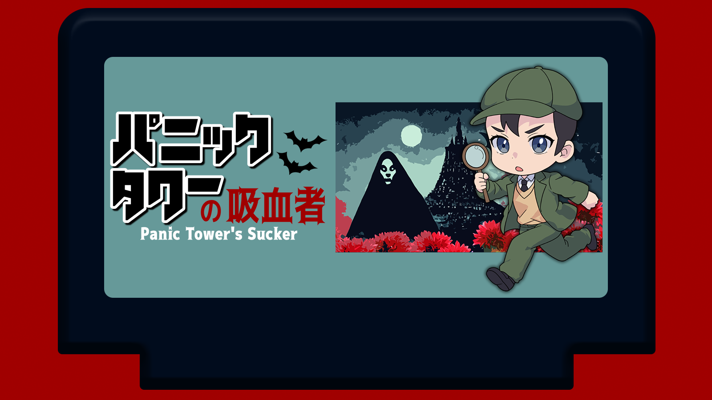

ptrst(パチリスト)です。
ぱちさん、もしくはぱっちーって呼んでください。ちょっとかわいいので。

かわいらしいアイコンは[@teru_gift](https://twitter.com/teru_gift)からいただきました。

## 経歴

1995年生まれの男性です。
東京理科大学の理学部数学科を卒業後、ウェブエンジニア（主にフロントエンド）として働いています。
折角なのでフロントエンド技術を駆使して快適なブログを作ろうぜってことで、このウェブサイトは生まれました。

## ポケモンが好きです。

ポケモンが大好きです！特にパチリスとオドリドリが推し。
ハンドルネームもパチリスから取りました。

大学時代には、東京理科大学のポケモンサークルで代表を務めていました。
対戦がメインで、15年以上ポケモンを楽しんでいます。
3～6世代が得意です。オフ会で複数回の優勝経験あり。

キャラランク外のマイナーポケモンを開拓することに定評があります。特に「4thGSのムクホーク」「SVダブルのトロピウス」の評価をランク外→中堅～上位キャラにまで押し上げたことが自慢です。

最近は、最新作のSVはストーリーをクリアした程度で、旧作をメインにプレイ中。
特に第四世代が好きで、自分でオフ会も主催しています。

## 制作物

### パニックタワーの吸血者

https://ptrst102.booth.pm/items/5959762

新クトゥルフ神話TRPGのシナリオです。

## 連絡先

https://twitter.com/ptrst102
